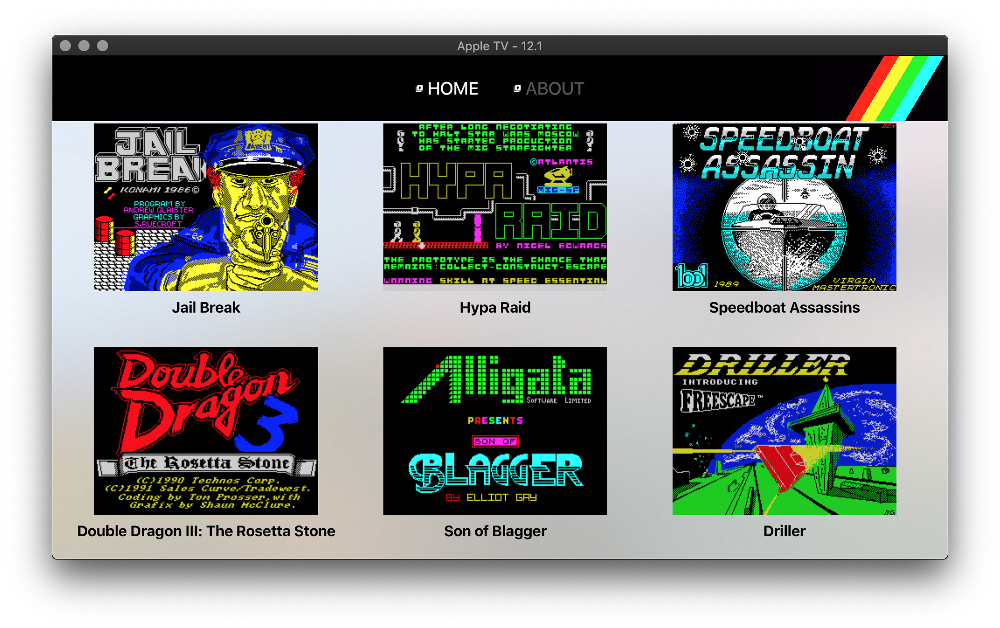
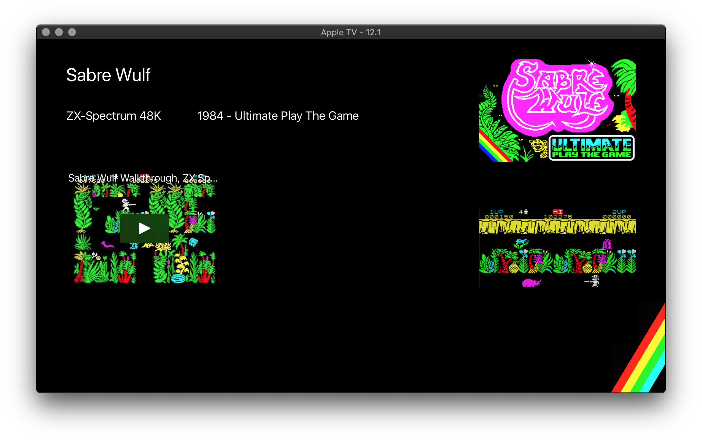

# zxinfo-tvos
This is an AppleTV app for watching historical informations related to the Sinclair related computers, using the [ZXDB](https://github.com/zxdb/ZXDB) based API at https://api.zxinfo.dk/doc/

As this is a dedicated TV experience, the main focus is videos related to Sinclair computers as stored in the ZXDB database.

## How to use
The main view shows a random selection of software entries from the ZXDB database, with videos associated.

Use the Apple TV remote to navigate, tap to watch details - including videos. Press Play/Pause on overview page to refreash content. On details view, select video and press Play/Pause to play.

Home screen | Details screen | Video
------------ | ------------- | -------------
 |  | 

## Installing ZXInfoTV
As for now there's no official approved way to embed and play YouTube videos on AppleTV. This app uses [XCDYouTubeKit](https://github.com/0xced/XCDYouTubeKit) as the YouTube player, and as it is known to violate the YouTube TOS - use at your own risk! Because of the use of XCDYouTubeKit, this app will not be available in the AppStore - until an official solution has been provided (by Google I assume).

For now the only way to install ZXInfoTV on your AppleTV - requires the knowledge of how to use and build apps using Xcode.

* Get source from this repository
* Setup dependencies using `pod install`
* Open code in Xcode - remember to use `open ZXInfoTV.xcworkspace`
* Build code in Xcode for your device

## Requirements
* macOS 10.13.6+ on a Mac
* Xcode 10+
* tvOS 10+ SDKs
* Free Apple Developer Account (at a minimum)
* [Cocoapods](https://cocoapods.org/)
